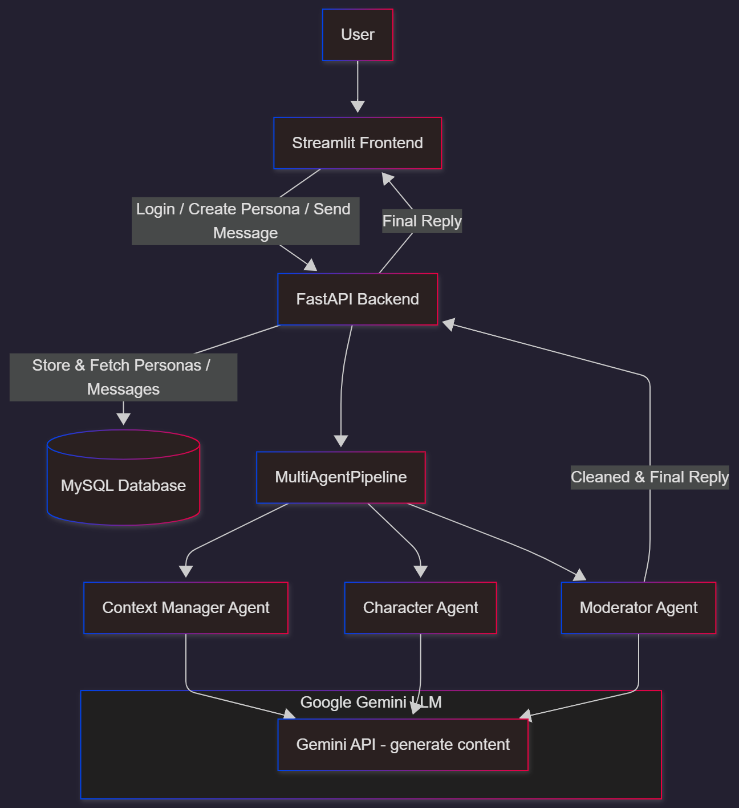

# Character AI – Multi-Agent Conversational System
### A Concierge-Style AI Companion Builder using FastAPI, Streamlit, MySQL & Gemini

## 🚀 Overview
Character AI is a full-stack multi-agent conversational system where users can:
- Create custom characters (“personas”)
- Assign tone, summary, and backstory
- Chat with each persona separately
- Maintain message history
- Delete personas
- View personas in a dashboard
- Interact through a clean Streamlit UI
- Receive responses generated by a 3-agent AI pipeline

## 🎯 Problem Statement
People want conversational AIs that behave like specific personalities (Sherlock Holmes, mentors, fictional characters).  
This requires memory, context awareness, tone consistency and safe responses — difficult to implement manually.

## 💡 Solution
We built a modular AI system with a multi-agent architecture:
1. **Context Agent** – Summarizes last messages
2. **Character Agent** – Generates persona-based replies
3. **Moderator Agent** – Ensures safe, clean output

Users can:

✔ Create personas  
✔ Chat with each persona  
✔ Retrieve full histories  
✔ Delete personas  
✔ Enjoy a simple UI  

## 🧠 Multi-Agent Architecture


## 🛠 Tech Stack
- Streamlit (Frontend)
- FastAPI (Backend)
- MySQL (Database)
- Gemini Flash (LLM)
- Python
- REST APIs

## 📚 Key Features
### Authentication
- Register
- Login
- Session state in Streamlit

### Persona Builder
- Create persona
- Auto/custom mode
- Tone and summary
- Delete personas
- List personas

### Chat Engine
- Full chat history
- Character-consistent replies
- Multi-agent processing

## 📁 Folder Structure
```
backend/
│── main.py
│── database.py
│── schemas.py
│── agents.py
│── utils.py
│── create.sql

frontend/
│── app.py

README.md
architecture.png
requirements.txt
.env
```

## 💾 Database Schema (MySQL)
- **users**
- **persona_flow**
- **persona_messages**

## 📦 How to Run Locally

### 1️⃣ Backend
```bash
cd backend
uvicorn main:app --reload
```

### 2️⃣ Frontend
```bash
cd frontend
streamlit run app.py
```

## 📜 License
MIT License
